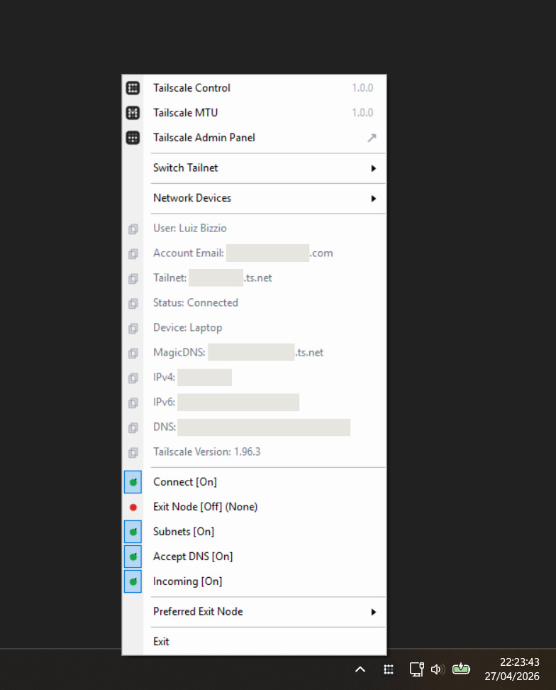
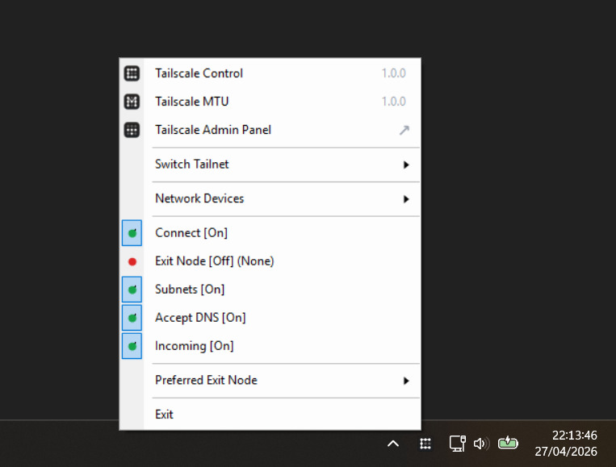

<h1 align="center">Tailscale Control 🎛️</h1>

<p align="center">
  <strong>A Windows tray app for faster Tailscale control.</strong>
</p>

<p align="center">
  Tailscale Control is not a replacement for Tailscale. It is a local control panel for quick actions, account switching, hotkeys, diagnostics, and Tailscale MTU integration without opening terminals or digging through menus.
</p>

<p align="center">
  <em>Independent and unofficial. This project is not affiliated with, endorsed by, or sponsored by Tailscale Inc.</em>
</p>

* * *

## ⚡ Install

Open **Windows Terminal** or **PowerShell** as your normal user, then run:

```powershell
powershell.exe -NoProfile -ExecutionPolicy Bypass -Command "irm 'https://github.com/luizbizzio/tailscale-control/releases/latest/download/install.ps1' | iex"
```

The installer downloads the release files, creates the local app folder, adds shortcuts, and starts Tailscale Control.

* * *

## 🎬 Application Demo

<p align="center">
  
</p>

<p align="center">
  <sub>Demo uses sample data. No real tailnet, IP address, account, or device information is shown.</sub>
</p>

## 🎬 Tray Menu Demo

<table align="center">
  <tr>
    <td align="center" valign="bottom">
      
    </td>
    <td align="center" valign="bottom">
      
    </td>
  </tr>
  <tr>
    <td align="center" valign="middle">
      <sub>Detailed tray mode shows the current device, account, DNS, IPs, and Tailscale state.</sub>
    </td>
    <td align="center" valign="middle">
      <sub>Compact tray mode keeps the tray focused on quick actions and navigation.</sub>
    </td>
  </tr>
</table>

* * *

## 🚀 Why use it?

<p align="center">
  Tailscale is excellent for private networking. Tailscale Control is built for the daily actions that become slow when repeated many times.
</p>

<table align="center">
  <tr>
    <th>Problem</th>
    <th>With only Tailscale</th>
    <th>With Tailscale Control</th>
  </tr>
  <tr>
    <td>Toggle connection fast</td>
    <td>Use the app or CLI</td>
    <td>One tray click or hotkey</td>
  </tr>
  <tr>
    <td>Toggle DNS or subnet routes</td>
    <td>Use CLI commands</td>
    <td>Tray menu, hotkey, or button</td>
  </tr>
  <tr>
    <td>Toggle incoming connections</td>
    <td>Use CLI</td>
    <td>Tray menu, hotkey, or button</td>
  </tr>
  <tr>
    <td>Switch accounts</td>
    <td>Use Tailscale account flow</td>
    <td>Quick Account Switch with hotkeys</td>
  </tr>
  <tr>
    <td>Pick a preferred exit node</td>
    <td>Select manually</td>
    <td>Save a preferred exit node</td>
  </tr>
  <tr>
    <td>Check devices and latency</td>
    <td>Use CLI commands</td>
    <td>Built-in list, info, tools, and ping</td>
  </tr>
  <tr>
    <td>Test DNS resolving</td>
    <td>Use terminal tools</td>
    <td>Built-in DNS Resolve tab</td>
  </tr>
  <tr>
    <td>Check public IP</td>
    <td>Use browser or CLI</td>
    <td>Built-in Public IP tab</td>
  </tr>
  <tr>
    <td>View recent actions</td>
    <td>Terminal output disappears</td>
    <td>Activity tab keeps output</td>
  </tr>
  <tr>
    <td>Manage Tailscale MTU</td>
    <td>Separate tool</td>
    <td>Integrated status, open, and install flow</td>
  </tr>
</table>

<p align="center">
  <strong>Less terminal. Fewer clicks. Faster control.</strong>
</p>

* * *

## 🧰 Requirements

<table align="center">
  <tr>
    <th>Requirement</th>
    <th>Needed</th>
  </tr>
  <tr>
    <td>Windows 10 or 11</td>
    <td align="center">✅</td>
  </tr>
  <tr>
    <td>Tailscale installed and running in unattended mode</td>
    <td align="center">✅</td>
  </tr>
  <tr>
    <td>Admin rights</td>
    <td align="center">Only for the auto-update scheduled task</td>
  </tr>
</table>

* * *


## 🔐 Security and Privacy

Tailscale Control runs locally on your Windows device.

It does not include a cloud backend, analytics service, telemetry system, or account server.

It uses the local Tailscale CLI and stores local app settings on your machine.

* * *

## 📄 License

This project is source-available under the **PolyForm Internal Use License 1.0.0**.

You may use it for personal use and internal business operations.

You may not sell, resell, sublicense, redistribute, publish paid builds, package it for app stores, or offer it as a commercial product without explicit permission from the author.

* * *

## ⚠️ Disclaimer

Tailscale Control is an independent, unofficial Windows utility for Tailscale.

It is not affiliated with, endorsed by, or sponsored by Tailscale Inc.

Tailscale is a trademark of Tailscale Inc.
